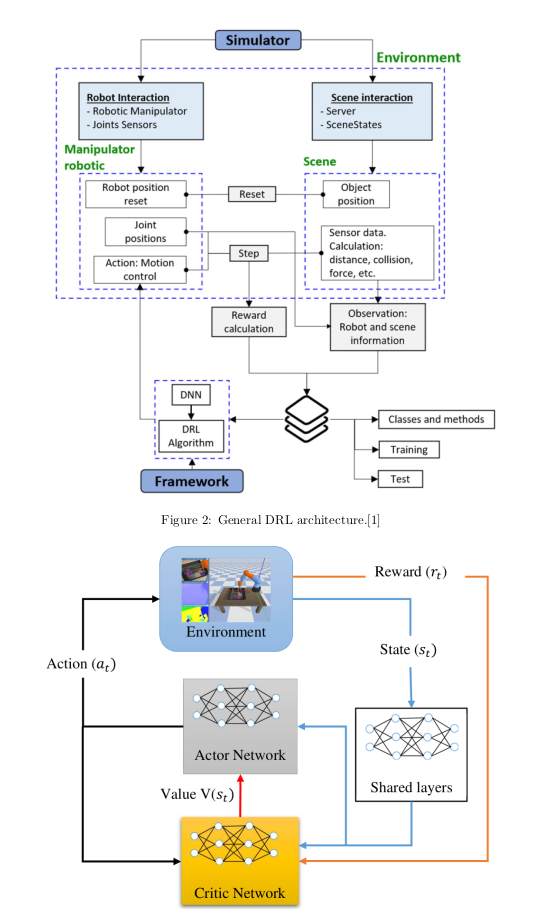
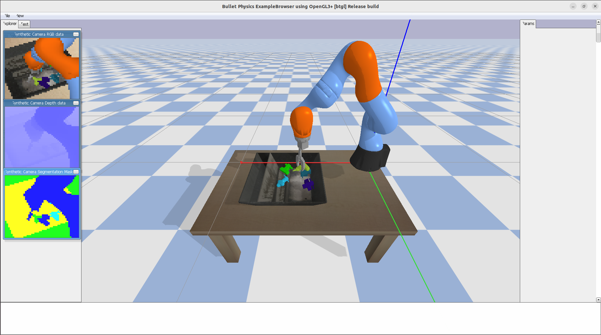
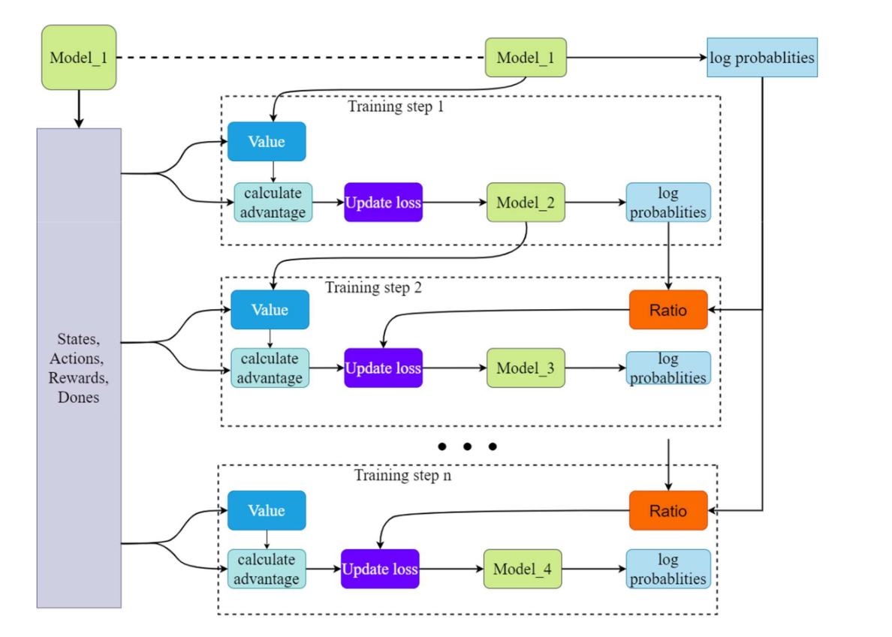
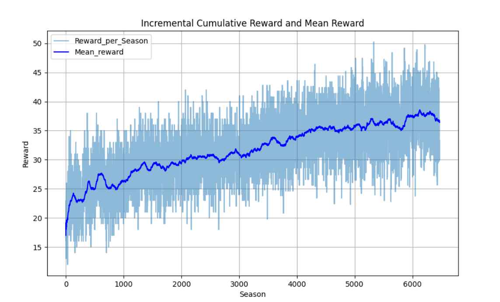

# Visual-Based Grasping Control Using PPO

## Project Overview

This project implements a reinforcement learning system for robotic grasping using a 7-DOF KUKA robotic arm in a PyBullet simulation. The agent uses **visual input** to perform grasping tasks and is trained with the **Proximal Policy Optimization (PPO)** algorithm. The goal is to optimize grasp success using an end-to-end actor-critic neural network.

**Institution**: Wrocław University of Science and Technology  
**Course**: Intermediate Project – Department of Cybernetics and Robotics  
**Author**: Samuel Gebretsadik  
**Date**: January 29, 2025


This diagram shows the architecture of the PPO-based KUKA pick-and-place pipeline.
---


## Demo Video

[](https://youtu.be/QAKlS_Xm9l8?si=7lwfycuQvNhlpUBT)
## Environment Details

- **Simulator**: PyBullet + OpenAI Gym interface
- **Robot**: KUKA 7DOF arm with a parallel-jaw gripper
- **Inputs**: RGB camera images
- **Outputs**: 5D continuous action vector  
  `[dx, dy, dz, rotation_angle, gripper_control]`
- **Training Hardware**: NVIDIA GeForce GTX 1650 Ti (4 GB)

---


## Reinforcement Learning Setup

- **Algorithm**: Proximal Policy Optimization (PPO)
- **Architecture**: Actor-Critic with shared CNN feature extractor
- **Rewards**:
  - `+1.0` for successful grasp
  - `+0.15` for contact with object
  - `-0.01` step penalty
- **Libraries**: PyTorch, TensorBoardX, Gym, PyBullet


Trajectory collection showing sampled robot actions during training.
---
## Training Result Visualization


---

## Training Workflow

1. Collect trajectories from environment using policy
2. Compute advantages using Generalized Advantage Estimation (GAE)
3. Optimize policy using PPO clipping
4. Save model and log statistics every season
5. Visualize training metrics and action distributions




The training loop uses PPO with a visual encoder, interacting with a PyBullet environment.



The reward curve shows stable improvement using the PPO algorithm over training steps.
---

## Results

- **Grasping Accuracy**: Reached up to **79%**
- **Mean Reward**: Increased steadily across training seasons
- **Training Duration**: ~45 hours (400 steps × 1M seasons)
- **Key Plots**:
  - Cumulative reward trends
  - Entropy and value loss curves
  - Action histograms
  - Epsilon/Beta decay curves

---

## How to Run

1. Clone the repo and install dependencies:
   ```bash
   pip install torch gym pybullet tensorboardX matplotlib
   ```

2. Run training:
   ```bash
   python mainn.py
   ```

3. View training logs in TensorBoard:
   ```bash
   tensorboard --logdir=runs
   ```

---

## License

This project is licensed under the **Creative Commons Attribution-NonCommercial-ShareAlike 4.0 International License**.

## Project Overview


---

## Training Progress


---

## Policy Visualization


---

## Learning Pipeline


